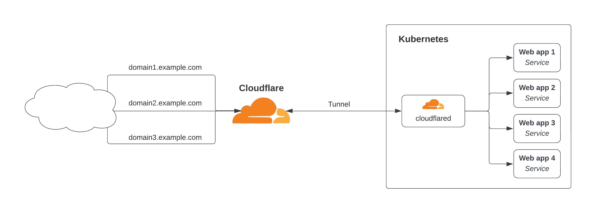
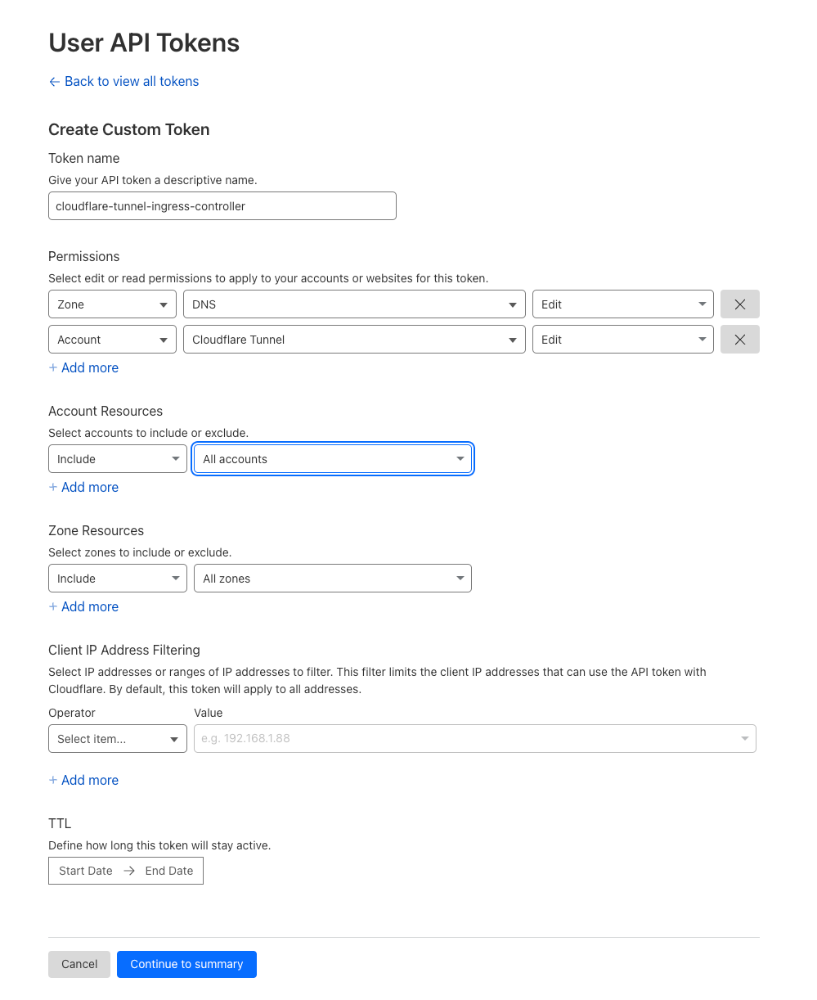

# Cloudflare Tunnel Ingress Controller

A Kubernetes Ingress Controller that uses Cloudflare Tunnel to expose services to the Internet securely without opening firewall ports.

## Table of Contents

- [Overview](#overview)
- [Features](#features)
- [How It Works](#how-it-works)
- [Prerequisites](#prerequisites)
- [Installation](#installation)
- [Configuration](#configuration)
- [Usage](#usage)
- [Advanced Features](#advanced-features)
- [Limitations](#limitations)
- [Uninstallation](#uninstallation)
- [About](#about)
- [License](#license)

## Overview

This controller is based on the [Kubernetes Ingress Controller for Cloudflare Argo Tunnel](https://github.com/cloudflare/cloudflare-ingress-controller) and the community-made project [STRRL/cloudflare-tunnel-ingress-controller](https://github.com/STRRL/cloudflare-tunnel-ingress-controller).

## Features

- Automatic Cloudflare Tunnel creation and management
- Automatic DNS record creation for Ingress resources
- Support for multiple domains across different zones
- Optional Kubernetes API server access via Cloudflare Tunnel
- Automatic route configuration based on Ingress resources

## How It Works



1. The Ingress Controller creates a new Cloudflare Tunnel on startup or uses an existing one
2. The controller watches for Ingress resources in the Kubernetes cluster
3. When a new Ingress resource is created, the controller creates a new route in the Cloudflare Tunnel and creates a DNS CNAME record pointing to the Tunnel hostname

## Prerequisites

### Cloudflare API Token

Before installing, you need:

1. **Cloudflare API Token** - Create at [Cloudflare / Profile / API Tokens](https://dash.cloudflare.com/profile/api-tokens)
2. **Cloudflare Account ID** - Find in your Cloudflare dashboard

#### Required API Token Permissions

The API token must have the following permissions:
- `Account:Cloudflare Tunnel:Edit`
- `Zone:DNS:Edit`

> [!IMPORTANT]
> Set up correct permissions for the API token:
>
> - Set a correct account for the token. Do not use the option *All accounts*, unless you have to!
> - Set a correct zone for the token. Do not use the option *All zones*, unless you have to!

When creating a new API token, your screen should look like this:



#### Create Kubernetes Secret

After obtaining an API token, create a Kubernetes Secret:

**Option 1: Using kubectl**

```shell
kubectl create secret generic --namespace cloudflare-tunnel-system cloudflare-api-token --from-literal=token=<your-cloudflare-api-token>
```

**Option 2: Using YAML manifest**

```yaml
# cloudflare-api-token.yaml
apiVersion: v1
kind: Secret
metadata:
  name: cloudflare-api-token
  namespace: cloudflare-tunnel-system
type: Opaque
stringData:
  token: <your-cloudflare-api-token> # CHANGE ME !!!
```

```shell
kubectl apply -f cloudflare-api-token.yaml
```

## Installation

### Using Helm

The Helm chart is stored in OCI format in our Helm repository.

```shell
export CLOUDFLARE_ACCOUNT_ID=<your-cloudflare-account-id>
export TUNNEL_NAME=<your-tunnel-name>

helm upgrade --install \
  --namespace cloudflare-tunnel-system --create-namespace \
  cloudflare-tunnel-ingress oci://registry.clbs.io/clbs-io/cloudflare-tunnel-ingress-controller/charts/cloudflare-tunnel-ingress-controller \
  --set config.cloudflare.apiToken.existingSecret.name=cloudflare-api-token \
  --set config.cloudflare.accountID=$CLOUDFLARE_ACCOUNT_ID \
  --set config.cloudflare.tunnelName=$TUNNEL_NAME
```

### Using ArgoCD

```yaml
apiVersion: argoproj.io/v1alpha1
kind: Application
metadata:
  name: cloudflare-tunnel-system
  namespace: argocd
spec:
  project: default
  syncPolicy:
    automated:
      prune: true
      selfHeal: true
    syncOptions:
      - CreateNamespace=true
  source:
    chart: cloudflare-tunnel-ingress-controller
    repoURL: registry.clbs.io/clbs-io/cloudflare-tunnel-ingress-controller/charts
    targetRevision: 0.5.102
    helm:
      releaseName: cloudflare-tunnel-ingress
      valuesObject:
        config:
          cloudflare:
            accountID: "d456f88c93489572d0956574f8cc4ca2"
            apiToken:
              existingSecret:
                name: cloudflare-api-token
            tunnelName: my-tunnel
          image:
            pullSecrets:
              - name: clbs-image-pull-secret
  destination:
    server: "https://kubernetes.default.svc"
    namespace: cloudflare-tunnel-system
```

## Configuration

### Required Values

| Parameter | Description | Example |
|-----------|-------------|---------|
| `config.cloudflare.accountID` | Your Cloudflare Account ID | `d456f88c93489572d0956574f8cc4ca2` |
| `config.cloudflare.tunnelName` | Name for the Cloudflare Tunnel | `my-tunnel` |
| `config.cloudflare.apiToken.existingSecret.name` | Name of the secret containing the API token | `cloudflare-api-token` |

### Optional Values

| Parameter | Description |
|-----------|-------------|
| `config.cloudflared.image` | Cloudflared image (must have explicit version, not "latest") |
| `config.cloudflared.imagePullPolicy` | Image pull policy for cloudflared |
| `ingressClass.name` | IngressClass name |
| `ingressClass.controller` | IngressClass controller name |
| `ingressClass.isDefaultClass` | Set as default IngressClass |
| `image.pullSecrets` | Image pull secrets for controller |

> [!NOTE]
> Default values can be found in the [values.yaml](charts/cloudflare-tunnel-ingress-controller/values.yaml) file.

> [!IMPORTANT]
> The `config.cloudflared.image` must have an explicit version tag. Using `latest` is not supported and will cause an error.

### Kubernetes API Tunnel (Optional)

Enable direct access to Kubernetes API server through Cloudflare Tunnel:

```yaml
config:
  kubernetesApiTunnel:
    enabled: true
    domain: k.example.com
    server: kubernetes.default.svc:443
    cloudflareAccessAppName: "Kubernetes API Tunnel"
```

## Usage

### Creating an Ingress Resource

Create an Ingress resource with the `cloudflare-tunnel` IngressClass:

```yaml
apiVersion: networking.k8s.io/v1
kind: Ingress
metadata:
  name: example-ingress
  namespace: default
spec:
  ingressClassName: cloudflare-tunnel
  rules:
  - host: app.example.com
    http:
      paths:
      - path: /
        pathType: Prefix
        backend:
          service:
            name: example-service
            port:
              number: 80
```

The controller will automatically:
1. Create a route in the Cloudflare Tunnel
2. Create a DNS CNAME record pointing to the tunnel
3. Configure the tunnel to forward traffic to your service

### Supported Path Types

The controller supports the following `pathType` values:
- `Prefix` - Matches URL path prefixes (recommended)
- `ImplementationSpecific` - Uses implementation-specific matching

> [!NOTE]
> `pathType: Exact` is **not supported** and will be silently skipped.

### Ingress Annotations

The controller supports annotations to customize tunnel behavior for each Ingress resource:

#### Backend Protocol

```yaml
metadata:
  annotations:
    cloudflare-tunnel-ingress-controller.clbs.io/backend-protocol: "http"
```

Controls the protocol used to connect to the backend service.

**Values:** `http`, `https`, `tcp` (default: `http`)

#### Origin Request Configuration

Fine-tune how cloudflared connects to your backend services:

| Annotation | Description | Example Value |
|------------|-------------|---------------|
| `cloudflare-tunnel-ingress-controller.clbs.io/origin-connect-timeout` | Timeout for establishing connection to origin | `30s` |
| `cloudflare-tunnel-ingress-controller.clbs.io/origin-tls-timeout` | Timeout for completing TLS handshake | `10s` |
| `cloudflare-tunnel-ingress-controller.clbs.io/origin-tcp-keepalive` | TCP keepalive interval | `30s` |
| `cloudflare-tunnel-ingress-controller.clbs.io/origin-no-happy-eyeballs` | Disable Happy Eyeballs for IPv4/IPv6 | `true` |
| `cloudflare-tunnel-ingress-controller.clbs.io/origin-keepalive-connections` | Maximum keepalive connections | `100` |
| `cloudflare-tunnel-ingress-controller.clbs.io/origin-keepalive-timeout` | Keepalive timeout | `90s` |
| `cloudflare-tunnel-ingress-controller.clbs.io/origin-http-host-header` | Custom Host header to send to origin | `internal.example.com` |
| `cloudflare-tunnel-ingress-controller.clbs.io/origin-server-name` | Server name for TLS verification | `internal.example.com` |
| `cloudflare-tunnel-ingress-controller.clbs.io/origin-no-tls-verify` | Disable TLS certificate verification | `true` |
| `cloudflare-tunnel-ingress-controller.clbs.io/origin-disable-chunked-encoding` | Disable chunked transfer encoding | `true` |
| `cloudflare-tunnel-ingress-controller.clbs.io/origin-proxy-type` | Proxy type for origin connection | `socks5` |
| `cloudflare-tunnel-ingress-controller.clbs.io/origin-http2origin` | Use HTTP/2 to connect to origin | `true` |

#### Example: HTTPS Backend with Self-Signed Certificate

```yaml
apiVersion: networking.k8s.io/v1
kind: Ingress
metadata:
  name: secure-app
  annotations:
    cloudflare-tunnel-ingress-controller.clbs.io/backend-protocol: "https"
    cloudflare-tunnel-ingress-controller.clbs.io/origin-no-tls-verify: "true"
spec:
  ingressClassName: cloudflare-tunnel
  rules:
  - host: secure.example.com
    http:
      paths:
      - path: /
        pathType: Prefix
        backend:
          service:
            name: secure-service
            port:
              number: 443
```

#### Example: TCP Backend

```yaml
apiVersion: networking.k8s.io/v1
kind: Ingress
metadata:
  name: tcp-service
  annotations:
    cloudflare-tunnel-ingress-controller.clbs.io/backend-protocol: "tcp"
spec:
  ingressClassName: cloudflare-tunnel
  rules:
  - host: tcp.example.com
    http:
      paths:
      - path: /
        pathType: Prefix
        backend:
          service:
            name: tcp-service
            port:
              number: 9000
```

## Advanced Features

### Accessing Kubernetes API via Cloudflare Tunnel

The `kubectl port-forward` command uses HTTP connection upgrades, which can fail when routed through a Cloudflare Tunnel. To resolve this, you can enable direct TCP access to the Kubernetes API server through the tunnel.

#### Step 1: Enable Kubernetes API Tunnel

Add the following configuration to your Helm values:

```yaml
config:
  kubernetesApiTunnel:
    enabled: true
    domain: k.example.com  # Your domain for API access
    server: kubernetes.default.svc:443
    cloudflareAccessAppName: "Kubernetes API Tunnel"
```

The controller will:
1. Create a Cloudflare Tunnel route for the specified domain
2. Create a DNS CNAME record
3. Create a Cloudflare Access application

> [!IMPORTANT]
> The controller creates the Cloudflare Access application but **does not configure access policies**. You must manually configure access policies in the Cloudflare dashboard to control who can access the Kubernetes API.

#### Step 2: Configure Cloudflare Access Policies

1. Go to [Cloudflare Zero Trust Dashboard](https://one.dash.cloudflare.com/)
2. Navigate to **Access** → **Applications**
3. Find the application named "Kubernetes API Tunnel" (or your custom name)
4. Add access policies to control authentication (e.g., allow specific email domains, GitHub organizations, etc.)

Without configured policies, the tunnel will be created but access will be denied.

#### Step 3: Start Local TCP Tunnel

Run `cloudflared` locally to create a SOCKS5 proxy:

```shell
cloudflared access tcp --hostname k.example.com --url 127.0.0.1:1080
```

This creates a SOCKS5 proxy on `127.0.0.1:1080` that forwards traffic through Cloudflare Access to your Kubernetes API.

#### Step 4: Update kubeconfig

Configure your kubeconfig to route traffic through the SOCKS5 proxy:

```yaml
clusters:
- cluster:
    certificate-authority-data: <your-ca-data>
    server: https://kubernetes.default.svc:443
    proxy-url: socks5://127.0.0.1:1080  # Points to cloudflared SOCKS5 proxy
  name: my-cluster-tunnel
```

The key settings:
- `server` - The actual Kubernetes API server address (inside the cluster)
- `proxy-url` - The local SOCKS5 proxy created by cloudflared (port 1080, not 6443)
- `certificate-authority-data` - Your cluster's CA certificate (optional if using insecure-skip-tls-verify)

This setup ensures kubectl commands (including `port-forward`) work correctly through the Cloudflare Tunnel.

## Limitations

### Single Tunnel Architecture

- The controller manages **exactly one Cloudflare Tunnel** per installation
- All Ingress resources share the same tunnel
- Multiple tunnel support is not available

### Cloudflared Deployment

- Fixed at **1 replica** (no high availability option)
- Resource limits/requests cannot be configured for cloudflared pod
- Metrics port hardcoded to `9090`
- Image tag must be explicit (e.g., `2025.11.1`) - **`latest` tag is not supported**

### Path Type Support

- ✅ Supported: `Prefix`, `ImplementationSpecific`
- ❌ Not Supported: `Exact` (silently skipped)

### TLS Handling

- Controller does not manage Ingress TLS certificates
- All TLS termination happens at Cloudflare edge
- Backend connections use protocol specified in annotations

### Kubernetes API Tunnel

- Controller only creates the Cloudflare Access application shell
- **Access policies must be configured manually** in Cloudflare dashboard
- No automatic authentication/authorization configuration

### Namespace Handling

- Cloudflared pod deploys in the controller's namespace
- Controller watches Ingress resources across all namespaces

## Uninstallation

```shell
helm uninstall --namespace cloudflare-tunnel-system cloudflare-tunnel-ingress
```

## About

This project is part of the [clbs.io](https://clbs.io) initiative - a public-source-code brand by [cybros labs](https://www.cybroslabs.com).

## License

This project is licensed under the Mozilla Public License 2.0 - see the [LICENSE](LICENSE) file for details.
