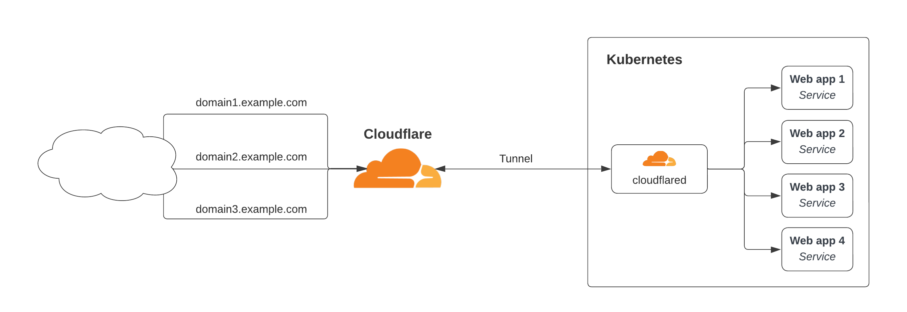
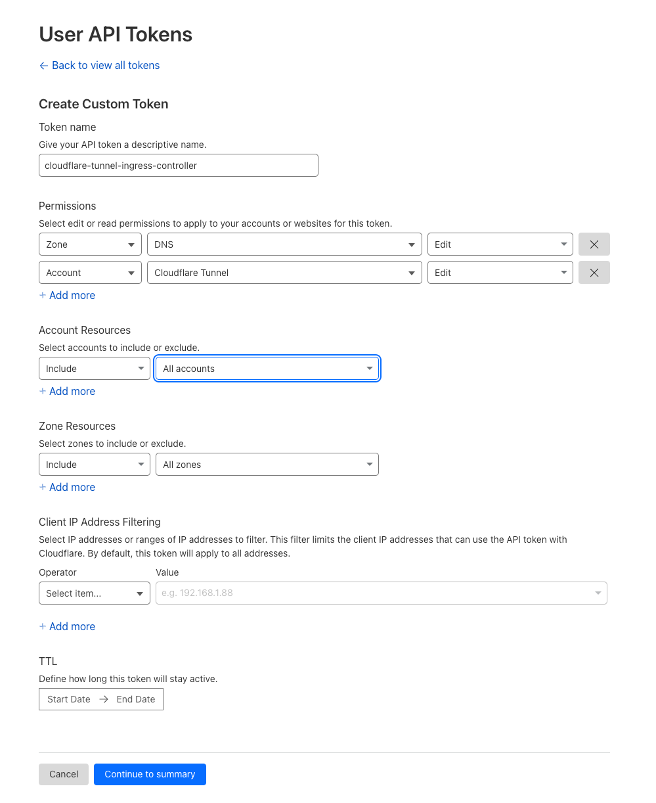

# Cloudflare Tunnel Ingress Controller

A Kubernetes Ingress Controller that exposes services to the Internet through [Cloudflare Tunnel](https://developers.cloudflare.com/cloudflare-one/connections/connect-networks/) — no open firewall ports required.

## Overview

This controller watches for Ingress resources, automatically creates Cloudflare Tunnel routes and DNS records, and deploys a `cloudflared` instance to handle traffic. Inspired by [cloudflare/cloudflare-ingress-controller](https://github.com/cloudflare/cloudflare-ingress-controller) and [STRRL/cloudflare-tunnel-ingress-controller](https://github.com/STRRL/cloudflare-tunnel-ingress-controller).

## Features

- Automatic Cloudflare Tunnel creation and management
- DNS CNAME record creation for each Ingress host
- Multiple domains across different Cloudflare zones
- Configurable backend protocols (`http`, `https`, `tcp`) and origin request settings
- Optional Kubernetes API server access via Cloudflare Tunnel with Zero Trust

## How It Works



1. On startup, the controller creates a Cloudflare Tunnel (or reuses an existing one by name)
2. It watches for Ingress resources with the configured IngressClass
3. For each Ingress, it creates tunnel routes and DNS CNAME records pointing to the tunnel

## Prerequisites

### Cloudflare API Token

Create an API token at [Cloudflare Dashboard / Profile / API Tokens](https://dash.cloudflare.com/profile/api-tokens) with the following permissions:

- `Account : Cloudflare Tunnel : Edit`
- `Zone : DNS : Edit`

> [!IMPORTANT]
> Scope the token to the specific account and zone(s) you need. Avoid using *All accounts* or *All zones* unless necessary.



You will also need your **Cloudflare Account ID**, which you can find in the Cloudflare dashboard.

### Create Kubernetes Secret

Create a Secret containing the API token before installing the chart:

```shell
kubectl create namespace cloudflare-tunnel-system

kubectl create secret generic cloudflare-api-token \
  --namespace cloudflare-tunnel-system \
  --from-literal=token=<your-cloudflare-api-token>
```

Or using a manifest:

```yaml
apiVersion: v1
kind: Secret
metadata:
  name: cloudflare-api-token
  namespace: cloudflare-tunnel-system
type: Opaque
stringData:
  token: <your-cloudflare-api-token>
```

## Installation

### Container Image

The controller image is publicly available — no credentials required:

```shell
docker pull registry.clbs.io/clbs-io/cloudflare-tunnel-ingress-controller/main:latest
```

Multi-architecture builds are available for `linux/amd64` and `linux/arm64`.

### Helm Chart

The chart is published in OCI format:

```shell
helm upgrade --install \
  --namespace cloudflare-tunnel-system --create-namespace \
  cloudflare-tunnel-ingress \
  oci://registry.clbs.io/clbs-io/cloudflare-tunnel-ingress-controller/charts/cloudflare-tunnel-ingress-controller \
  --set config.cloudflare.accountID=<your-account-id> \
  --set config.cloudflare.tunnelName=<your-tunnel-name>
```

> [!NOTE]
> This assumes you already created the `cloudflare-api-token` Secret. To use a different Secret name, add `--set config.cloudflare.apiToken.existingSecret.name=<name>`.

### ArgoCD

```yaml
apiVersion: argoproj.io/v1alpha1
kind: Application
metadata:
  name: cloudflare-tunnel-system
  namespace: argocd
spec:
  project: default
  syncPolicy:
    automated:
      prune: true
      selfHeal: true
    syncOptions:
      - CreateNamespace=true
  source:
    chart: cloudflare-tunnel-ingress-controller
    repoURL: registry.clbs.io/clbs-io/cloudflare-tunnel-ingress-controller/charts
    targetRevision: "*"
    helm:
      releaseName: cloudflare-tunnel-ingress
      valuesObject:
        config:
          cloudflare:
            accountID: "<your-account-id>"
            tunnelName: my-tunnel
  destination:
    server: "https://kubernetes.default.svc"
    namespace: cloudflare-tunnel-system
```

## Configuration

### Required Values

| Parameter | Description | Example |
|-----------|-------------|---------|
| `config.cloudflare.accountID` | Cloudflare Account ID | `d456f88c934...` |
| `config.cloudflare.tunnelName` | Tunnel name (created if it doesn't exist) | `my-tunnel` |

### Optional Values

| Parameter | Description | Default |
|-----------|-------------|---------|
| `config.cloudflare.apiToken.existingSecret.name` | Secret name containing the API token | `cloudflare-api-token` |
| `config.cloudflare.apiToken.existingSecret.key` | Key within the Secret | `token` |
| `config.cloudflared.image` | Cloudflared sidecar image (**must have explicit tag**) | `cloudflare/cloudflared:2026.2.0` |
| `config.cloudflared.imagePullPolicy` | Pull policy for cloudflared | `IfNotPresent` |
| `ingressClass.name` | IngressClass name | `cloudflare-tunnel` |
| `ingressClass.controller` | Controller class identifier | `clbs.io/cloudflare-tunnel-ingress-controller` |
| `ingressClass.isDefaultClass` | Set as default IngressClass | `false` |
| `replicaCount` | Controller replicas | `1` |
| `image.pullSecrets` | Image pull secrets for controller | `[]` |
| `resources` | CPU/memory requests and limits | See [values.yaml](charts/cloudflare-tunnel-ingress-controller/values.yaml) |
| `podSecurityContext` | Pod-level security context | `runAsNonRoot: true`, `runAsUser: 1001` |
| `securityContext` | Container-level security context | `readOnlyRootFilesystem: true`, drop `ALL` |
| `nodeSelector` | Node selector for scheduling | `{}` |
| `tolerations` | Tolerations for scheduling | `[]` |
| `affinity` | Affinity rules for scheduling | `{}` |

> [!IMPORTANT]
> The `config.cloudflared.image` must have an explicit version tag. Using `latest` is not supported and will cause an error.

All defaults are in [values.yaml](charts/cloudflare-tunnel-ingress-controller/values.yaml).

## Usage

### Basic Ingress

```yaml
apiVersion: networking.k8s.io/v1
kind: Ingress
metadata:
  name: example
spec:
  ingressClassName: cloudflare-tunnel
  rules:
    - host: app.example.com
      http:
        paths:
          - path: /
            pathType: Prefix
            backend:
              service:
                name: my-service
                port:
                  number: 80
```

The controller will automatically create a tunnel route and a DNS CNAME record for `app.example.com`.

### Path Types

- **`Prefix`** — matches URL path prefixes (recommended)
- **`ImplementationSpecific`** — treated as prefix match
- **`Exact`** — not supported (silently skipped)

### Annotations

Customize tunnel behavior per Ingress using annotations with the prefix `cloudflare-tunnel-ingress-controller.clbs.io/`:

#### Backend Protocol

```yaml
annotations:
  cloudflare-tunnel-ingress-controller.clbs.io/backend-protocol: "https"
```

Values: `http` (default), `https`, `tcp`

#### Origin Request Settings

| Annotation suffix | Description | Example |
|-------------------|-------------|---------|
| `origin-connect-timeout` | Connection timeout to origin | `30s` |
| `origin-tls-timeout` | TLS handshake timeout | `10s` |
| `origin-tcp-keepalive` | TCP keepalive interval | `30s` |
| `origin-no-happy-eyeballs` | Disable Happy Eyeballs | `true` |
| `origin-keepalive-connections` | Max keepalive connections | `100` |
| `origin-keepalive-timeout` | Keepalive timeout | `90s` |
| `origin-http-host-header` | Custom Host header | `internal.example.com` |
| `origin-server-name` | TLS server name | `internal.example.com` |
| `origin-no-tls-verify` | Skip TLS verification | `true` |
| `origin-disable-chunked-encoding` | Disable chunked encoding | `true` |
| `origin-proxy-type` | Proxy type | `socks5` |
| `origin-http2origin` | Use HTTP/2 to origin | `true` |

#### Example: HTTPS Backend with Self-Signed Certificate

```yaml
apiVersion: networking.k8s.io/v1
kind: Ingress
metadata:
  name: secure-app
  annotations:
    cloudflare-tunnel-ingress-controller.clbs.io/backend-protocol: "https"
    cloudflare-tunnel-ingress-controller.clbs.io/origin-no-tls-verify: "true"
spec:
  ingressClassName: cloudflare-tunnel
  rules:
    - host: secure.example.com
      http:
        paths:
          - path: /
            pathType: Prefix
            backend:
              service:
                name: secure-service
                port:
                  number: 443
```

## Kubernetes API Tunnel

Enable direct access to the Kubernetes API server through Cloudflare Tunnel with Zero Trust protection. This is useful when `kubectl port-forward` fails through regular tunnel routing due to HTTP connection upgrades.

### Step 1: Enable in Helm Values

```yaml
config:
  kubernetesApiTunnel:
    enabled: true
    domain: k.example.com
    server: kubernetes.default.svc:443
    cloudflareAccessAppName: "Kubernetes API Tunnel"
```

The controller will create a tunnel route, DNS record, and a Cloudflare Access application.

> [!IMPORTANT]
> The controller creates the Access application but **does not configure policies**. You must add access policies manually in the Cloudflare dashboard.

### Step 2: Configure Access Policies

1. Go to [Cloudflare Zero Trust Dashboard](https://one.dash.cloudflare.com/) → **Access** → **Applications**
2. Find the application (default name: "Kubernetes API Tunnel")
3. Add policies to control who can access the API (email domains, GitHub orgs, etc.)

### Step 3: Connect Locally

Run `cloudflared` to create a local SOCKS5 proxy:

```shell
cloudflared access tcp --hostname k.example.com --url 127.0.0.1:1080
```

### Step 4: Configure kubeconfig

```yaml
clusters:
  - cluster:
      certificate-authority-data: <your-ca-data>
      server: https://kubernetes.default.svc:443
      proxy-url: socks5://127.0.0.1:1080
    name: my-cluster-tunnel
```

- `server` — the Kubernetes API address inside the cluster
- `proxy-url` — the local SOCKS5 proxy from cloudflared

## Limitations

- **Single tunnel per installation** — all Ingress resources share one Cloudflare Tunnel
- **Cloudflared deployment** — fixed at 1 replica; resource limits not configurable; metrics port hardcoded to `9090`
- **`pathType: Exact`** — not supported (silently skipped)
- **TLS** — all TLS termination happens at Cloudflare edge; the controller does not manage certificates
- **Kubernetes API Tunnel** — access policies must be configured manually in Cloudflare dashboard
- **Namespace** — cloudflared deploys in the controller's namespace; Ingress resources are watched across all namespaces

## Uninstallation

```shell
helm uninstall --namespace cloudflare-tunnel-system cloudflare-tunnel-ingress
```

> [!NOTE]
> The Cloudflare Tunnel and its DNS records are **not** automatically deleted on uninstall. Clean them up manually in the Cloudflare dashboard if needed.

## About

This project is part of the [clbs.io](https://clbs.io) initiative — a public-source-code brand by [cybros labs](https://www.cybroslabs.com).

## License

[Mozilla Public License 2.0](LICENSE)
