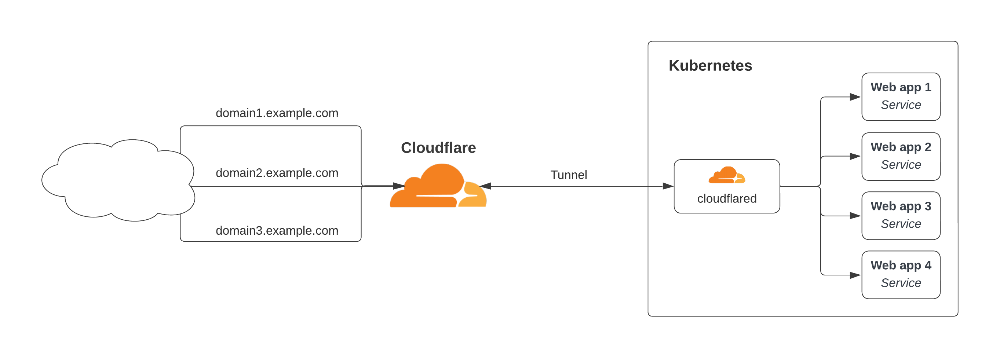
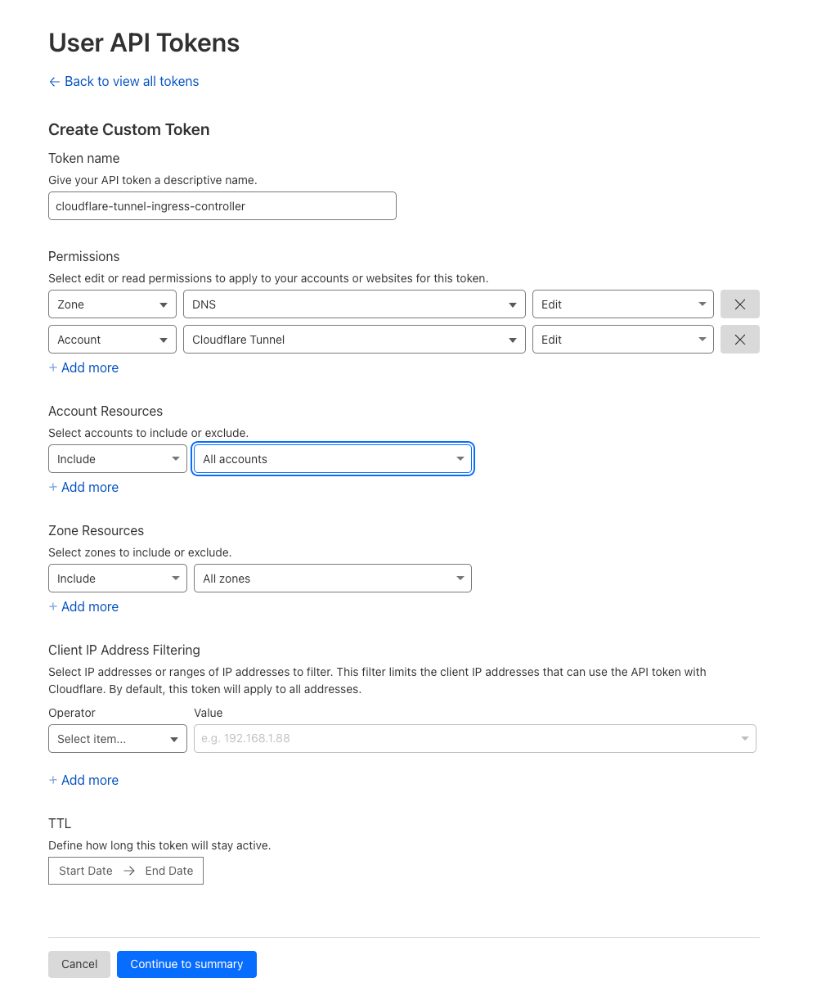

# Cloudflare Tunnel Ingress Controller

A Kubernetes Ingress Controller that exposes services to the Internet through [Cloudflare Tunnel](https://developers.cloudflare.com/cloudflare-one/connections/connect-networks/) — no open firewall ports required.

## Overview

This controller watches for Ingress resources, automatically creates Cloudflare Tunnel routes and DNS records, and deploys a `cloudflared` instance to handle traffic. Inspired by [cloudflare/cloudflare-ingress-controller](https://github.com/cloudflare/cloudflare-ingress-controller) and [STRRL/cloudflare-tunnel-ingress-controller](https://github.com/STRRL/cloudflare-tunnel-ingress-controller).

## Features

- Automatic Cloudflare Tunnel creation and management
- DNS CNAME record creation for each Ingress host
- Multiple domains across different Cloudflare zones
- Configurable backend protocols (`http`, `https`, `tcp`) and origin request settings
- Optional Kubernetes API server access via Cloudflare Tunnel with Zero Trust

## How It Works



1. On startup, the controller creates a Cloudflare Tunnel (or reuses an existing one by name)
2. It watches for Ingress resources with the configured IngressClass
3. For each Ingress, it creates tunnel routes and DNS CNAME records pointing to the tunnel
4. The chart runs `cloudflared` as the `<release>-cloudflared` Deployment; the controller writes the tunnel token into the `<release>-tunnel-token` Secret, which the `cloudflared` pods mount, and rolls the pods whenever the token changes

## Prerequisites

### Cloudflare API Token

Create an API token at [Cloudflare Dashboard / Profile / API Tokens](https://dash.cloudflare.com/profile/api-tokens) with the following permissions:

- `Account : Cloudflare Tunnel : Edit`
- `Zone : Zone : Read`
- `Zone : DNS : Edit`

If you enable the [Kubernetes API Tunnel](#kubernetes-api-tunnel) or use the [`access-app-name`](#cloudflare-access) annotation, also add:

- `Account : Access: Apps and Policies : Edit`

> [!IMPORTANT]
> Scope the token to the specific account and zone(s) you need. Avoid using *All accounts* or *All zones* unless necessary.

Zones the token can list but whose DNS records it cannot read are skipped; every zone holding an Ingress hostname needs `Zone : DNS : Edit`.



You will also need your **Cloudflare Account ID**, which you can find in the Cloudflare dashboard.

### Create Kubernetes Secret

Create a Secret containing the API token before installing the chart:

```shell
kubectl create namespace cloudflare-tunnel-system

kubectl create secret generic cloudflare-api-token \
  --namespace cloudflare-tunnel-system \
  --from-literal=token=<your-cloudflare-api-token>
```

Or using a manifest:

```yaml
apiVersion: v1
kind: Secret
metadata:
  name: cloudflare-api-token
  namespace: cloudflare-tunnel-system
type: Opaque
stringData:
  token: <your-cloudflare-api-token>
```

## Installation

### Container Image

The controller image is publicly available — no credentials required:

```shell
docker pull registry.clbs.io/clbs-io/cloudflare-tunnel-ingress-controller/main:latest
```

Multi-architecture builds are available for `linux/amd64` and `linux/arm64`.

### Helm Chart

The chart is published in OCI format:

```shell
helm upgrade --install \
  --namespace cloudflare-tunnel-system --create-namespace \
  cloudflare-tunnel-ingress \
  oci://registry.clbs.io/clbs-io/cloudflare-tunnel-ingress-controller/charts/cloudflare-tunnel-ingress-controller \
  --set config.cloudflare.accountID=<your-account-id> \
  --set config.cloudflare.tunnelName=<your-tunnel-name>
```

> [!NOTE]
> This assumes you already created the `cloudflare-api-token` Secret. To use a different Secret name, add `--set config.cloudflare.apiToken.existingSecret.name=<name>`.

### ArgoCD

```yaml
apiVersion: argoproj.io/v1alpha1
kind: Application
metadata:
  name: cloudflare-tunnel-system
  namespace: argocd
spec:
  project: default
  syncPolicy:
    automated:
      prune: true
      selfHeal: true
    syncOptions:
      - CreateNamespace=true
  source:
    chart: cloudflare-tunnel-ingress-controller
    repoURL: registry.clbs.io/clbs-io/cloudflare-tunnel-ingress-controller/charts
    targetRevision: "*"
    helm:
      releaseName: cloudflare-tunnel-ingress
      valuesObject:
        config:
          cloudflare:
            accountID: "<your-account-id>"
            tunnelName: my-tunnel
  destination:
    server: "https://kubernetes.default.svc"
    namespace: cloudflare-tunnel-system
```

## Configuration

### Required Values

| Parameter | Description | Example |
|-----------|-------------|---------|
| `config.cloudflare.accountID` | Cloudflare Account ID | `d456f88c934...` |
| `config.cloudflare.tunnelName` | Tunnel name (created if it doesn't exist) | `my-tunnel` |

### Optional Values

| Parameter | Description | Default |
|-----------|-------------|---------|
| `config.cloudflare.apiToken.existingSecret.name` | Secret name containing the API token | `cloudflare-api-token` |
| `config.cloudflare.apiToken.existingSecret.key` | Key within the Secret | `token` |
| `ingressClass.name` | IngressClass name | `cloudflare-tunnel` |
| `ingressClass.controller` | Controller class identifier | `clbs.io/cloudflare-tunnel-ingress-controller` |
| `ingressClass.isDefaultClass` | Set as default IngressClass | `false` |
| `replicaCount` | Controller replicas | `1` |
| `extraArgs` | Extra arguments appended to the controller container | `[]` |
| `image.pullSecrets` | Image pull secrets for controller | `[]` |
| `resources` | CPU/memory requests and limits | See [values.yaml](charts/cloudflare-tunnel-ingress-controller/values.yaml) |
| `podSecurityContext` | Pod-level security context | `runAsNonRoot: true`, `runAsUser: 1001` |
| `securityContext` | Container-level security context | `readOnlyRootFilesystem: true`, drop `ALL` |
| `nodeSelector` | Node selector for scheduling | `{}` |
| `tolerations` | Tolerations for scheduling | `[]` |
| `affinity` | Affinity rules for scheduling | `{}` |

> [!IMPORTANT]
> The `cloudflared.image` must have an explicit version tag. Using `latest` is not supported and will cause an error.

All defaults are in [values.yaml](charts/cloudflare-tunnel-ingress-controller/values.yaml).

The controller also accepts `--resync-period` (full reconcile interval, default `10m`) and `--leader-elect` (default `true`, so only one replica reconciles); pass them through `extraArgs`, for example `extraArgs: ["--resync-period=5m"]`.

### cloudflared Values

| Parameter | Description | Default |
|-----------|-------------|---------|
| `cloudflared.image` | cloudflared image (**must have explicit tag**) | `cloudflare/cloudflared:2026.9.1` |
| `cloudflared.imagePullPolicy` | Pull policy for cloudflared | `IfNotPresent` |
| `cloudflared.imagePullSecrets` | Image pull secrets for cloudflared | `[]` |
| `cloudflared.replicas` | cloudflared replicas | `2` |
| `cloudflared.extraArgs` | Extra `cloudflared tunnel` flags, for example `["--protocol=quic", "--loglevel=warn"]` | `[]` |
| `cloudflared.resources` | CPU/memory requests and limits | See [values.yaml](charts/cloudflare-tunnel-ingress-controller/values.yaml) |
| `cloudflared.terminationGracePeriodSeconds` | Grace period before a pod is killed; longer than cloudflared's 30s `--grace-period`, so connections drain | `45` |
| `cloudflared.podSecurityContext` | Pod-level security context | `runAsNonRoot: true`, `runAsUser: 65532` |
| `cloudflared.securityContext` | Container-level security context | `readOnlyRootFilesystem: true`, drop `ALL` |
| `cloudflared.nodeSelector` | Node selector for scheduling | `{}` |
| `cloudflared.tolerations` | Tolerations for scheduling | `[]` |
| `cloudflared.affinity` | Affinity rules for scheduling | `{}` |
| `cloudflared.topologySpreadConstraints` | Topology spread constraints; empty spreads replicas across nodes when possible | `[]` |
| `cloudflared.priorityClassName` | Pod priority class | `""` |
| `cloudflared.podAnnotations` | Extra annotations on cloudflared pods | `{}` |
| `cloudflared.podLabels` | Extra labels on cloudflared pods | `{}` |
| `cloudflared.podDisruptionBudget.enabled` | Create a PodDisruptionBudget (only takes effect with more than one replica) | `true` |
| `cloudflared.podDisruptionBudget.minAvailable` | Minimum available cloudflared pods | `1` |
| `cloudflared.podMonitor.enabled` | Create a Prometheus Operator PodMonitor for cloudflared | `false` |
| `cloudflared.podMonitor.interval` | Scrape interval for the PodMonitor | `30s` |
| `cloudflared.podMonitor.labels` | Extra labels on the PodMonitor, for a Prometheus Operator `podMonitorSelector` | `{}` |

> [!NOTE]
> `config.cloudflared.image` and `config.cloudflared.imagePullPolicy` are deprecated and still take precedence over `cloudflared.image` / `cloudflared.imagePullPolicy` when set.

## Usage

### Basic Ingress

```yaml
apiVersion: networking.k8s.io/v1
kind: Ingress
metadata:
  name: example
spec:
  ingressClassName: cloudflare-tunnel
  rules:
    - host: app.example.com
      http:
        paths:
          - path: /
            pathType: Prefix
            backend:
              service:
                name: my-service
                port:
                  number: 80
```

The controller will automatically create a tunnel route and a DNS CNAME record for `app.example.com`.

### Path Types

- **`Prefix`** — Kubernetes prefix match on path elements: `/static` matches `/static` and `/static/x`, not `/staticfoo`
- **`Exact`** — the path must match exactly
- **`ImplementationSpecific`** — a [Go regular expression](https://pkg.go.dev/regexp/syntax) matched anywhere in the path, as `cloudflared` does; an empty path, `/` and `^/` match every path, like `Prefix` `/`

Rules are ordered so the most specific one wins: exact hosts before wildcard hosts before rules without a host, `Exact` before other path types, longer paths first. When two Ingresses define the same host and path, the older Ingress wins.

A wildcard host such as `*.example.com` matches subdomains of any depth in `cloudflared` (`a.example.com` and `a.b.example.com`), unlike Kubernetes, where it matches a single label.

When the [Kubernetes API Tunnel](#kubernetes-api-tunnel) is enabled, its hostname cannot be used by Ingresses: their rules on that host are dropped with a `RuleConflict` Event.

### Annotations

Customize tunnel behavior per Ingress using annotations with the prefix `cloudflare-tunnel-ingress-controller.clbs.io/`:

#### Backend Protocol

```yaml
annotations:
  cloudflare-tunnel-ingress-controller.clbs.io/backend-protocol: "https"
```

Values: `http` (default), `https`, `tcp`

#### Cloudflare Access

Link a tunnel route to an existing Cloudflare Access application or auto-create one.

**Option 1: Link to an existing Access application** — configure `cloudflared` to require Access authentication on this route:

```yaml
annotations:
  cloudflare-tunnel-ingress-controller.clbs.io/access-required: "true"
  cloudflare-tunnel-ingress-controller.clbs.io/access-team-name: "myteam"
  cloudflare-tunnel-ingress-controller.clbs.io/access-aud-tag: "tag1,tag2"
```

| Annotation suffix | Description | Example |
|-------------------|-------------|---------|
| `access-required` | Require Cloudflare Access authentication | `true` |
| `access-team-name` | Access team name | `myteam` |
| `access-aud-tag` | Audience (AUD) tags, comma-separated | `tag1,tag2` |

**Option 2: Auto-create an Access application** — the controller will create a self-hosted Cloudflare Access application for each hostname in the Ingress:

```yaml
annotations:
  cloudflare-tunnel-ingress-controller.clbs.io/access-app-name: "My App"
```

> [!IMPORTANT]
> Auto-created Access applications have **no policies** configured. You must add access policies manually in the Cloudflare dashboard. This option requires the `Account : Access: Apps and Policies : Edit` API token permission.

Both options can be combined on the same Ingress.

#### Origin Request Settings

| Annotation suffix | Description | Example |
|-------------------|-------------|---------|
| `origin-connect-timeout` | Connection timeout to origin | `30s` |
| `origin-tls-timeout` | TLS handshake timeout | `10s` |
| `origin-tcp-keepalive` | TCP keepalive interval | `30s` |
| `origin-no-happy-eyeballs` | Disable Happy Eyeballs | `true` |
| `origin-keepalive-connections` | Max keepalive connections | `100` |
| `origin-keepalive-timeout` | Keepalive timeout | `90s` |
| `origin-http-host-header` | Custom Host header | `internal.example.com` |
| `origin-server-name` | TLS server name | `internal.example.com` |
| `origin-no-tls-verify` | Skip TLS verification | `true` |
| `origin-disable-chunked-encoding` | Disable chunked encoding | `true` |
| `origin-proxy-type` | Proxy type; `socks` runs a SOCKS proxy for the route | `socks` |
| `origin-http2origin` | Use HTTP/2 to origin | `true` |

Timeouts are Go durations in whole seconds, at least `1s` (for example `30s` or `1m30s`); other values are ignored. Settings without an annotation keep the `cloudflared` defaults.

#### Example: HTTPS Backend with Self-Signed Certificate

```yaml
apiVersion: networking.k8s.io/v1
kind: Ingress
metadata:
  name: secure-app
  annotations:
    cloudflare-tunnel-ingress-controller.clbs.io/backend-protocol: "https"
    cloudflare-tunnel-ingress-controller.clbs.io/origin-no-tls-verify: "true"
spec:
  ingressClassName: cloudflare-tunnel
  rules:
    - host: secure.example.com
      http:
        paths:
          - path: /
            pathType: Prefix
            backend:
              service:
                name: secure-service
                port:
                  number: 443
```

### Events

The controller reports Ingress content it cannot publish as Warning Events on the Ingress (`kubectl describe ingress <name>`); the rest of the Ingress is still published:

| Reason | Cause |
|---|---|
| `RuleSkipped` | resource backend, unknown named Service port, invalid `ImplementationSpecific` regex, missing `pathType` |
| `RuleConflict` | the host and path are already served by an older Ingress, or the host is the Kubernetes API Tunnel hostname |
| `InvalidAnnotation` | an annotation value cannot be parsed, or an unknown backend protocol |
| `Unsupported` | `spec.defaultBackend` |
| `DNSConflict` | a DNS record for the host exists and does not point to the tunnel |

## Kubernetes API Tunnel

Enable direct access to the Kubernetes API server through Cloudflare Tunnel with Zero Trust protection. This is useful when `kubectl port-forward` fails through regular tunnel routing due to HTTP connection upgrades.

### Step 1: Enable in Helm Values

```yaml
config:
  kubernetesApiTunnel:
    enabled: true
    domain: k.example.com
    server: kubernetes.default.svc:443
    cloudflareAccessAppName: "Kubernetes API Tunnel"
```

The controller will create a tunnel route, DNS record, and a Cloudflare Access application.

> [!IMPORTANT]
> The controller creates the Access application but **does not configure policies**. You must add access policies manually in the Cloudflare dashboard.

### Step 2: Configure Access Policies

1. Go to [Cloudflare Zero Trust Dashboard](https://one.dash.cloudflare.com/) → **Access** → **Applications**
2. Find the application (default name: "Kubernetes API Tunnel")
3. Add policies to control who can access the API (email domains, GitHub orgs, etc.)

### Step 3: Connect Locally

Run `cloudflared` to create a local SOCKS5 proxy:

```shell
cloudflared access tcp --hostname k.example.com --url 127.0.0.1:1080
```

### Step 4: Configure kubeconfig

```yaml
clusters:
  - cluster:
      certificate-authority-data: <your-ca-data>
      server: https://kubernetes.default.svc:443
      proxy-url: socks5://127.0.0.1:1080
    name: my-cluster-tunnel
```

- `server` — the Kubernetes API address inside the cluster
- `proxy-url` — the local SOCKS5 proxy from cloudflared

## Limitations

- **Single tunnel per installation** — all Ingress resources share one Cloudflare Tunnel
- **cloudflared metrics port** — `9090`, serving `/metrics`, `/ready`, `/healthcheck`, `/config` (the tunnel's ingress rules) and `/debug/pprof` to the pod network
- **`spec.defaultBackend`** — not supported (reported as an Event)
- **TLS** — all TLS termination happens at Cloudflare edge; the controller does not manage certificates
- **Kubernetes API Tunnel** — access policies must be configured manually in Cloudflare dashboard
- **Namespace** — cloudflared deploys in the controller's namespace; Ingress resources are watched across all namespaces
- **One release per namespace** — two releases in the same namespace share one leader-election lease, so only one of them reconciles; install one release per namespace

## Upgrading

The `cloudflared` Deployment is rendered by the chart as `<release>-cloudflared` (`<release>-connector` when a release named `cloudflare-tunnel` would otherwise collide with the legacy Deployment name below). If a `cloudflare-tunnel-cloudflared` Deployment created by an older release of the controller is still present, it is deleted automatically once the chart's Deployment has an available replica. No manual cleanup is needed.

> [!IMPORTANT]
> Upgrade the chart and the controller image together, and do not pin `image.tag` across chart versions: the controller requires the `TUNNEL_TOKEN_SECRET` and `CLOUDFLARED_DEPLOYMENT` environment variables, which only this chart version provides. The controller itself no longer runs `cloudflared`; an installation that does not use this chart must run `cloudflared` itself, pointed at the token Secret.

- `cloudflared` must be `2025.4.0` or later, since the chart runs it with `--token-file`. An older `config.cloudflared.image` / `cloudflared.image` makes the new pods fail while the legacy Deployment keeps serving traffic.
- `helm upgrade --reuse-values` does not pick up the new `cloudflared.*` values from this chart version; use `--reset-then-reuse-values` instead.
- Default `cloudflared` replicas change from `1` to `2`; the pods now run as uid `65532` with a read-only root filesystem.
- On a single-node cluster, set `cloudflared.podDisruptionBudget.enabled=false` — the PodDisruptionBudget would otherwise block draining the only node.

## Uninstallation

```shell
helm uninstall --namespace cloudflare-tunnel-system cloudflare-tunnel-ingress
```

> [!NOTE]
> The Cloudflare Tunnel, its DNS records and the `<release>-tunnel-token` Secret are **not** automatically deleted on uninstall. Clean up the tunnel and DNS records manually in the Cloudflare dashboard if needed.

## About

This project is part of the [clbs.io](https://clbs.io) initiative — a public-source-code brand by [cybros labs](https://www.cybroslabs.com).

## License

[Mozilla Public License 2.0](LICENSE)
